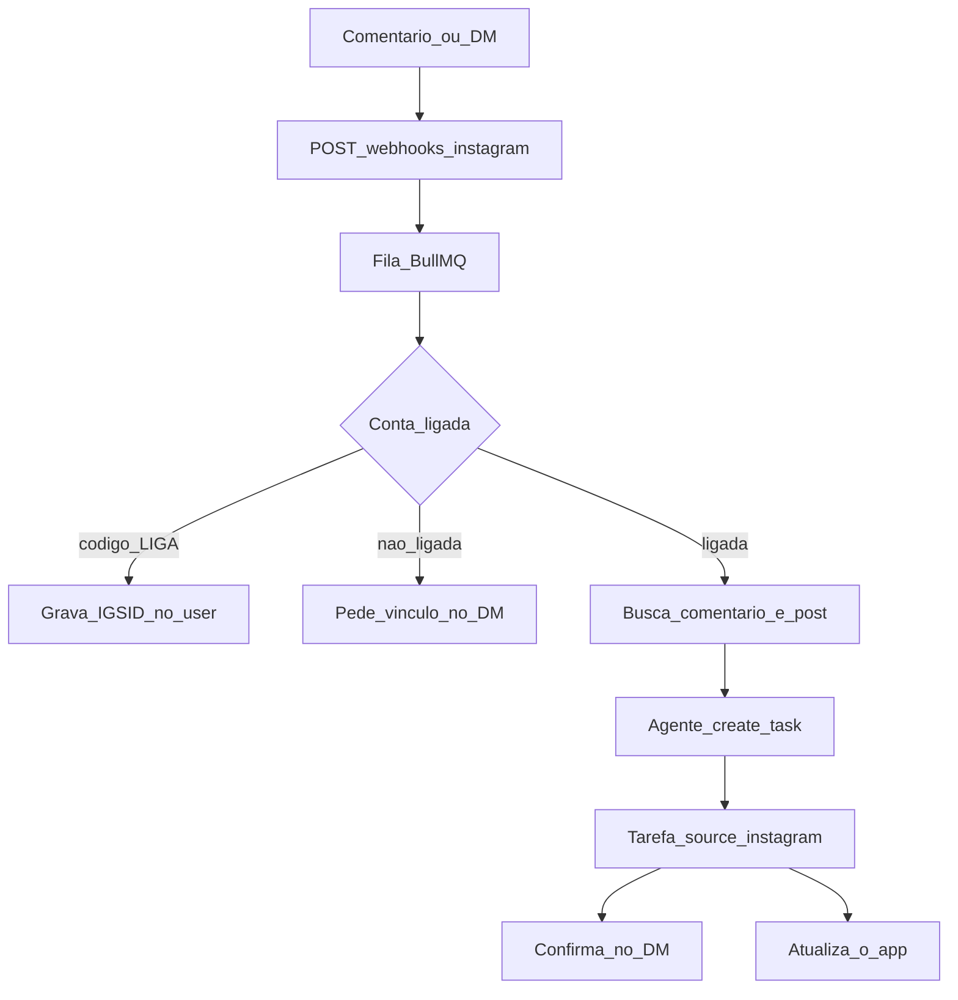

# Instagram cria tarefa na Jarvi

**O que é:** marcar `@jarvi.life` (ou mandar um DM) cria uma tarefa na conta da pessoa.

**Para quem é este documento**

- **Parte A** — qualquer pessoa. O que o usuário faz e o que aparece na Jarvi.
- **Parte B** — o time. Banco, webhook, agente, Settings, review da Meta, fases, arquivos.
- **Parte C** — os dois juntos. Glossário, FAQ e decisões já tomadas.

Este arquivo é a fonte em Markdown. O PDF gerado fica em [instagram-tarefas.pdf](instagram-tarefas.pdf). A feature **ainda não está no produto** — este texto descreve o que vamos construir.

Analogia curta: é o WhatsApp da Jarvi, no Instagram. Existe um canal da marca (`@jarvi.life`). A pessoa só liga a identidade dela.

---

## Sumário

1. [Parte A — O que é](#parte-a--o-que-é)
2. [Parte B — Como vamos implementar](#parte-b--como-vamos-implementar)
3. [Parte C — Junto](#parte-c--junto)

---

# Parte A — O que é

*Leia esta parte se você só quer entender a ideia. Sem código.*

## O problema

Você está no Instagram e vê um post útil — um Reel de jardim, uma dica de compra, um passo a passo. Na hora você pensa: “preciso fazer isso”. Depois esquece.

A Jarvi já resolve isso no WhatsApp: você manda uma mensagem e vira tarefa. A ideia nova é fazer o mesmo **sem sair do Instagram**.

## O exemplo do jardim

1. Um perfil publica um Reel: “3 ideias para o jardim”.
2. A ideia 3 é: comprar um adubo específico.
3. Você comenta no post: `@jarvi.life cria tarefa da ideia 3`.
4. A Jarvi lê o comentário e o post.
5. Na sua lista aparece uma tarefa do tipo **Comprar o adubo X sugerido no Reel**.
6. No Direct da `@jarvi.life` chega uma confirmação curta. O comentário público **não** mostra o título da tarefa.

Isso é a “mágica”. O caminho mais estável (e o que construímos primeiro) é outro gesto nativo: **compartilhar o post no DM da `@jarvi.life`** e escrever “ideia 3”. Ou colar o link do Reel nesse DM.

## Duas contas no Instagram

Não é “a Jarvi lê o Instagram inteiro da pessoa”. São duas contas, com papéis diferentes:

| Conta | Papel |
| --- | --- |
| `@jarvi.life` | O bot. É nela que a Meta avisa: “alguém marcou vocês” ou “alguém mandou DM”. |
| O Instagram da pessoa | Só serve para saber **de quem** é a tarefa. |

Igual ao WhatsApp: um número da Jarvi no meio; o telefone da pessoa identifica a conta.

## Três passos do usuário

### 1. Ligar o Instagram (uma vez)

Sem isso, um comentário não tem dono. Qualquer um pode marcar `@jarvi.life`. A Jarvi precisa saber em **qual lista** criar a tarefa.

O jeito é o mesmo do WhatsApp hoje:

1. No app da Jarvi: Settings → Apps → Instagram → **Gerar código**.
2. Aparece algo como `LIGA 847291` (expira em poucos minutos).
3. A pessoa manda esse código no **Direct da `@jarvi.life`**.
4. A Jarvi responde: “Instagram ligado. Pode me marcar nos posts.”

Não basta digitar `@maria` nas settings. Alguém poderia colocar o @ de outra pessoa e receber as tarefas dela. O código no DM prova que aquele Instagram é daquela conta Jarvi.

Esse primeiro DM faz duas coisas:

- prova a identidade;
- **abre a conversa**, para a Jarvi confirmar tarefa no privado depois, sem escrever “comprar adubo X” no post do influencer.

### 2. Capturar (toda vez que quiser uma tarefa)

Dois jeitos:

**Comentário (a ideia original)**

Num post **público**, a pessoa comenta marcando `@jarvi.life` e diz o que quer. Exemplo: “ideia 3, cria a tarefa”.

**Direct (o caminho mais estável)**

A pessoa manda para `@jarvi.life`:

- o texto do que fazer;
- ou o link do post (`instagram.com/reel/...`) + “ideia 3”;
- ou o share nativo do post + uma frase.

### 3. Ver o resultado

- A tarefa aparece na Jarvi, com um selo “via Instagram”.
- No DM, uma frase curta: o que foi criado, com link para o app.
- Se a captura foi por comentário, o comentário público no máximo ganha um “✓” genérico — **nunca** o título da tarefa.

## O que a Jarvi faz, em linguagem humana

1. A Meta avisa a `@jarvi.life`: “fulano comentou” ou “fulano mandou mensagem”.
2. A Jarvi pergunta: essa pessoa já ligou o Instagram na conta dela?
3. Se não: pede o vínculo. Não cria tarefa.
4. Se sim: lê o que a pessoa escreveu e, quando der, o post (legenda, link, às vezes foto ou vídeo).
5. A mesma inteligência que já cria tarefa pelo WhatsApp monta um título claro.
6. A tarefa entra na lista. O app atualiza na hora. O DM confirma.

## O que funciona bem e o que não funciona

**Funciona bem**

- Comentário + menção em **post público**, se a pessoa já ligou a conta.
- DM com texto claro (“comprar adubo orgânico X amanhã”).
- DM com o **link** do post colado + o que fazer.
- Legenda do post que já lista as ideias (“1. … 2. … 3. comprar adubo Y”).

**Funciona pela metade**

- Reel em que a ideia 3 existe **só na fala** do vídeo. A Meta **não** entrega a transcrição pronta. Sem baixar o vídeo e “ouvir”, a tarefa pode ficar genérica: “Ver ideia 3 do post de jardim”.
- Share nativo de um post **de outra pessoa** no DM. Muitas vezes chega só um arquivo temporário, **sem** a legenda e **sem** o link bonito. Por isso pedimos o link colado quando der.

**Não funciona**

- Post de conta **privada**.
- Comentário oculto ou restrito.
- Stories (somem em 24 horas; é outro mecanismo).
- Marcar `@jarvi.life` sem ter ligado o Instagram na Jarvi — a tarefa não tem dono.
- Qualquer pessoa da internet criando tarefa na sua lista. Só vale o Instagram **ligado e verificado** na sua conta.

## Privacidade

O comentário no post do jardim é **público**. Se a Jarvi responder ali “Criei: comprar adubo orgânico X”, o mundo inteiro vê o que você vai fazer.

Por isso:

- detalhe da tarefa só no **DM** e no **app**;
- no comentário, no máximo um “✓”;
- menção de quem não ligou a conta não vira tarefa (evita spam e evita criar item na lista errada).

## Por que não é “ligar um fio e pronto”

O pedaço técnico de “receber o aviso da Meta” é simples. O que trava o lançamento para **qualquer** pessoa marcar `@jarvi.life` é a **porta da Meta**:

- a `@jarvi.life` precisa ser conta Professional ligada a uma Página;
- a Jarvi precisa de um app no Meta for Developers;
- um humano da Meta lê o pedido de permissão (App Review);
- até aprovar, só contas de teste disparam o fluxo.

Isso não é um fim de semana. A Parte B detalha o que pedir e o que não pedir.

## O que a pessoa *não* precisa saber

Não precisa saber o que é API, webhook ou IGSID. Na prática:

1. Liga o Instagram uma vez (código no DM).
2. Marca `@jarvi.life` ou manda o post no Direct.
3. A tarefa aparece.

---

# Parte B — Como vamos implementar

*Leia esta parte se você vai construir ou revisar o código. O modelo é o canal WhatsApp que já existe.*

## O que já existe hoje (não reinventar)

A Jarvi já captura tarefa por canal externo:

```
mensagem WhatsApp → webhook Twilio → fila → agente (texto / áudio / imagem) → create_task
```

Gmail segue a mesma família (pending task). Instagram é **mais um canal**: o comentário ou o DM vira o texto do usuário; o post vira contexto; o agente chama `create_task`.

Referências no repo:

- Plano WhatsApp: [docs/WHATSAPP_TASKS.md](../WHATSAPP_TASKS.md)
- Agente WhatsApp: `packages/backend/src/services/agent/channels/whatsapp.ts`
- Ferramenta `create_task`: `packages/backend/src/services/agent/core/tools.ts`
- Webhook WhatsApp: `packages/backend/src/controllers/whatsappWebhookController.ts` + `packages/backend/src/queues/whatsappQueue.ts`
- Vínculo de telefone: colunas em `users` (`whatsapp_phone`, `whatsapp_verified`, `whatsapp_link_code`, …) em `packages/backend/src/database/index.ts`
- Tela de apps: `packages/web/src/components/features/account/SettingsDialog/pages/AppsPage.tsx` (hoje só WhatsApp está `available: true`)
- Telemetria: `packages/backend/src/services/taskTelemetry.ts` (`web` | `agent_web` | `whatsapp` | `gmail`)

O que **não** existe: integração Instagram, webhook de menção, nem “este @ do IG = esta conta Jarvi”.

## Visão do pipeline



Passo a passo:

1. `POST /api/webhooks/instagram` — GET responde `hub.challenge`; POST valida `X-Hub-Signature-256`.
2. Enfileira (BullMQ + Redis), no molde de `whatsappQueue`.
3. Se o texto for o código `LIGA …`: grava o IGSID no `users` e para.
4. Se não houver user ligado: DM “conecte em Settings → Instagram” e para.
5. Se ligado: busca comment + media (menção) ou texto + anexo (DM).
6. Opcional, numa fase tardia: baixa imagem/vídeo e passa em Whisper / visão.
7. `runAgent` com profile `instagram` → `create_task`.
8. DM de confirmação (sem vazar no comentário público).
9. Socket.io para a lista do web atualizar (já existe o padrão `pending-task:created` / refresh de tarefa via WhatsApp).

**Pending task no MVP:** não. WhatsApp hoje cria tarefa direta. Instagram igual, com “desfazer” no DM se quisermos. Gmail que usa `pending_tasks`.

## Comentário vs DM — o que a API realmente entrega

| | Comentário + menção | DM / share |
| --- | --- | --- |
| Legenda do post | Forte (Mentions API: caption, permalink) | Fraco em post de **terceiro** (muitas vezes só URL `lookaside.fbsbx.com`) |
| Vídeo / fala do Reel | Frágil (sem transcrição nativa) | Frágil (CDN às vezes ajuda) |
| Privacidade | Comentário é público | Privado |
| História na App Review | Mais fácil parecer “lemos a rede” | “Cliente falou com a empresa” |
| Post precisa ser público | Sim | Não |
| Confirmar sem expor a tarefa | Só se o DM já existir (por isso o vínculo) | Natural |

**Decisão de produto:** os dois, nesta ordem.

1. Vínculo sempre por DM + código.
2. **MVP de captura:** DM (texto, link colado, ou share).
3. **Feature de marketing:** comentário + menção; o DM só confirma.

Se a pessoa colar `instagram.com/reel/...` no DM, temos permalink mesmo quando o share da Meta vier pobre.

A menção em **post de terceiro** (o Reel do jardim) é o caso da Mentions API. O caminho mais documentado ainda é **Facebook Login for Business** + campo de webhook `mentions`. O login mais novo (Instagram Login / `graph.instagram.com`) junta menção no webhook de `comments` e é mais simples para DM; a leitura rica do post alheio é mais duvidosa. Se a estrela for o comentário no post dos outros, começamos no Facebook Login.

## Banco de dados

Espelha o WhatsApp. Sem token do Instagram **do usuário** se o vínculo for por código. O token é só o da `@jarvi.life`, no servidor (`.env`), como as credenciais Twilio.

### Colunas novas em `users`

| Coluna | Para quê |
| --- | --- |
| `instagram_igsid` UNIQUE | Id estável que vem no webhook (o “telefone” do Instagram, visto pela `@jarvi.life`) |
| `instagram_username` | Chip na UI: “ligado como @ana” |
| `instagram_verified` | Só cria tarefa se verdadeiro |
| `instagram_link_code` | O `LIGA 847291` |
| `instagram_link_code_expires_at` | Expiração do código |
| `instagram_connected_at` | Settings / auditoria |

Índice único em `instagram_igsid`, no mesmo espírito de `idx_users_whatsapp_phone_unique`.

### Colunas / valores em `tasks`

A tabela já tem `source` e `original_whatsapp_content`.

| Campo | Para quê |
| --- | --- |
| `source = 'instagram'` | Chip “via Instagram”; PostHog |
| `original_instagram_content` | Comentário + caption, no espírito do WhatsApp |
| `instagram_comment_id` | Dedup (a Meta reenvia webhook) |
| `instagram_media_id` | Buscar o post de novo se precisar |
| `instagram_permalink` | Link clicável na tarefa |

`TaskCreatedSource` em `taskTelemetry.ts` ganha `'instagram'`.

### Tabela nova `instagram_events`

Idempotência do webhook:

- `id`
- `event_id` ou `comment_id` / `message_mid` (único)
- `user_id` (nullable se ainda não ligado)
- `task_id` (nullable)
- `status`: `ignored_unlinked` | `linked` | `created` | `failed`
- `created_at`

Webhook chega duas vezes → não cria duas tarefas.

### O que não vai no banco do user

- Page token / Instagram user token da `@jarvi.life`
- App secret

Isso fica no `.env`:

- `INSTAGRAM_APP_SECRET` — assinar webhook
- `INSTAGRAM_VERIFY_TOKEN` — `hub.verify_token`
- `INSTAGRAM_PAGE_TOKEN` (ou user token da conta Professional)
- `INSTAGRAM_IG_USER_ID` — id da `@jarvi.life`
- `INSTAGRAM_PAGE_ID` — Página ligada, se Facebook Login

## Backend — arquivos previstos

No molde do WhatsApp, sem inventar outra arquitetura:

```
packages/backend/src/
├── controllers/instagramWebhookController.ts
├── routes/instagramRoutes.ts          → GET+POST /api/webhooks/instagram
├── queues/instagramQueue.ts
├── services/instagramService.ts       → Graph: mention, media, send DM
└── services/agent/channels/instagram.ts
```

Mais:

- migration / `ALTER` em `packages/backend/src/database/index.ts` (o projeto migra no startup);
- rotas autenticadas de vínculo, espelhando `whatsapp-link` / `whatsapp-link/request` / `whatsapp-link/verify` (o verify do Instagram é o DM com o código, não um POST de SMS);
- `source: 'instagram'` no `create_task` do channel, para o chip na UI.

O channel profile copia o do WhatsApp (`toolsAvailable` de tarefa + memória, `outputFormat: 'plain'`, `transport: 'single'`). `create_task` já escreve em `tasks`.

## Frontend

- `AppsPage.tsx`: entrada Instagram `available: true`, subpágina no molde do WhatsApp (gerar código, mostrar @ ligado, desligar).
- Chip “via Instagram” onde hoje existe o chip WhatsApp (`taskAppSource` / origem da tarefa).
- Toast / socket: mesma família do “Nova tarefa criada via WhatsApp.”
- Desligar Instagram: apaga `instagram_igsid` e para o processamento. Isso entra na política de privacidade que a Meta pede.

Não copiar regras de Dialog do web para outras superfícies. A tela nova vive no Settings que já existe.

## Agente e qualidade da tarefa

O agente já sabe:

- título concreto a partir de anexo / contexto;
- descrição em Markdown, segunda pessoa;
- não inventar categoria;
- criar tarefa direto (WhatsApp).

Para Instagram, o prompt extra precisa deixar claro:

- o comentário é a **intenção** (“ideia 3”);
- a caption / mídia é o **contexto**;
- se não der para saber o adubo, criar tarefa honesta (“Rever ideia 3 do Reel de jardim”) e perguntar no DM, em vez de inventar produto;
- nunca colocar na descrição que “anexamos o Instagram” em jargão interno.

Transcrição de Reel (Whisper + frames) é **fase 5**, não MVP. Caption + comentário cobrem o caso em que o post já lista as ideias.

## App Review da Meta

Dois produtos no mesmo app se quisermos os dois fluxos. **Business Verification** da empresa Jarvi é obrigatória para Advanced Access.

### Login

Facebook Login for Business se a feature-estrela for menção em post de terceiro. Instagram Login é mais limpo para DM; pior documentado para Mentions ricas.

### Permissões mínimas (Facebook Login)

Pedir **só** isto:

| Permissão | Texto para o revisor |
| --- | --- |
| `instagram_basic` | Identificar a `@jarvi.life` e o autor da menção/DM |
| `instagram_manage_comments` | Receber menção e, se quisermos, um “✓” no comentário |
| `instagram_manage_messages` | Vínculo por DM + confirmação privada |
| `pages_show_list` | Listar a Página ligada à `@jarvi.life` |
| `pages_manage_metadata` | Inscrever webhook na Página |
| `pages_read_engagement` | Exigida junto com comments/mentions |

Webhook no dashboard: objeto `instagram`, campos `mentions` (ou `comments`) + `messages`.

### Não pedir

Isso aumenta chance de recusa e parece scraping:

- `instagram_manage_insights`
- **Instagram Public Content Access** (ler post público *sem* menção a nós)
- ads, catálogo, publicar conteúdo

Frase que importa na justificativa:

> Só processamos eventos em que a `@jarvi.life` foi mencionada ou DMada, e só se essa pessoa vinculou o Instagram na Jarvi. Não coletamos feed, hashtag nem post sem menção.

### Vídeo para o revisor

1. Settings da Jarvi → gerar código.
2. DM para `@jarvi.life` com o código → “ligado”.
3. Comentário num post **público de teste** marcando `@jarvi.life` (e/ou share no DM).
4. Tarefa aparece **só** na conta daquela pessoa.
5. Confirmação no DM, sem vazar o conteúdo no comentário.
6. Uma menção de conta **não ligada** → nenhuma tarefa.

Mais: política de privacidade pública + como apagar dados (desligar nas settings).

### Modo teste vs Live

Antes da review, o webhook só funciona com tester cadastrado no app. O código pode existir; **ninguém de fora** dispara o fluxo até Advanced Access + app Live. Por isso “não é um fim de semana de webhook”: o fio é simples; o cadeado da Meta não é.

## Fases de implementação

Ordem que reduz risco de review e entrega valor cedo:

| Fase | O que entrega | Precisa de review Live? |
| --- | --- | --- |
| 1 | Colunas de vínculo + tela no `AppsPage` (gerar código, status, desligar) | Não |
| 2 | Webhook de `messages` + código `LIGA` + `create_task` a partir de texto/link no DM | Só testers |
| 3 | App Review pedindo `instagram_manage_messages` (+ basic/pages). Produto usável: DM → tarefa | Sim, para o público |
| 4 | Mentions + `instagram_manage_comments` (segunda review se necessário) | Sim |
| 5 | Transcrição de Reel se caption + comentário não bastar | Não (é qualidade, não permissão nova) |

Fases 1–2 cabem em desenvolvimento interno. Fase 3 é o cadeado. Fase 4 é o comentário no jardim. Fase 5 é a “ideia 3” falada no vídeo.

## Arquivos que este *documento* não muda

A implementação futura toca backend, web e telemetria. **Este passo** só adiciona:

- este Markdown;
- o PDF gerado;
- links no mapa do handbook.

Não implementamos webhook, colunas nem tela neste PR.

## Riscos (para não surpreender depois)

- Meta recusar comments/mentions se a descrição parecer “varrer o Instagram”. Mitigação: texto da review + só processar menção da `@jarvi.life` + user ligado.
- Share de post alheio no DM sem caption. Mitigação: pedir o link; MVP de DM aceita URL colada.
- `media_url` de Reel some ou não vem. Mitigação: não depender disso no MVP.
- Responder no comentário público vaza a tarefa. Mitigação: confirmação só no DM.
- IGSID é por app / por conta Professional. Não misturar ids de outro produto Meta.
- Rate limit da Mentions API. Fila + idempotência.

---

# Parte C — Junto

*Glossário, FAQ e o que já está decidido. Serve para a Parte A e a Parte B conversarem.*

## Glossário

**`@jarvi.life`** — conta Professional da Jarvi no Instagram. É o “número” do bot.

**App Review** — um humano da Meta lê o pedido de permissão. Sem isso, o app não recebe evento de usuário real.

**Advanced Access** — nível de permissão que vale para todo mundo, não só testers.

**Business Verification** — a empresa Jarvi precisa estar verificada no Business Manager. Sem isso a review não anda.

**Caption** — a legenda do post. É o pedaço de texto do post que a API costuma entregar.

**Chip “via Instagram”** — selo na tarefa, igual ao “via WhatsApp”.

**Código `LIGA`** — senha curta gerada nas settings. A pessoa manda no DM da `@jarvi.life` para provar que aquele Instagram é dela.

**Facebook Login for Business** — jeito clássico de o app Jarvi falar com a Graph API (`graph.facebook.com`), com Página no meio. Melhor documentado para menção em post de terceiro.

**IGSID** — Instagram-scoped ID. Número interno que a Meta usa para “essa pessoa, vista pela `@jarvi.life`”. É o equivalente ao telefone no WhatsApp. Não é o @ público.

**Instagram Login** — jeito mais novo (`graph.instagram.com`). Mais simples para DM; pior para o caso “comentário no Reel dos outros”.

**Mentions API** — porta oficial para ler comentário e post em que a `@jarvi.life` foi **marcada**. Não é varrer a rede.

**Pending task** — tarefa sugerida esperando “sim”. Gmail usa. WhatsApp hoje **não** usa no caminho feliz. Instagram no MVP também não.

**Permalink** — o link estável do post (`instagram.com/p/...` ou `/reel/...`).

**Professional** — conta Business ou Creator. Conta pessoal comum não recebe esse webhook.

**Scraping** — ler o Instagram por fora da API (abrir a página, copiar escondido). A Meta proíbe. Nós **não** fazemos isso. Usamos o webhook e a API oficial. Mesmo assim a review pode recusar se o *texto* do pedido parecer scraping.

**Webhook** — recado automático. A Meta chama uma URL nossa: “aconteceu uma menção” ou “chegou um DM”. Não ficamos perguntando a cada segundo.

**Webhook em modo teste** — só testers do app disparam. Por isso o fio pode existir e o produto público ainda não.

## FAQ

### Isso é scraping?

Não. Scraping é um robô abrindo o Instagram sem autorização da Meta. O fluxo da Jarvi é: a pessoa marca ou manda DM → a Meta avisa → a Jarvi pede à API **só aquele** comentário/post. Não coletamos feed, hashtag nem post sem menção.

### Então por que a review pode recusar “se parecer scraping”?

O revisor julga a **intenção**. Se o vídeo e o texto soarem “vamos ler qualquer post da internet”, recusam — mesmo com endpoint oficial. Por isso a justificativa e o vídeo mostram: só menção/DM, só user ligado.

### O que significa “não é um fim de semana de webhook”?

O webhook (a URL que recebe o JSON) um time experiente monta rápido. O que não cabe num fim de semana é o pacote em volta: conta Professional, Página, app no Developers, Business Verification, gravar o vídeo, esperar a fila, às vezes reenviar o pedido. Até Live + Advanced Access, só tester.

### Se a ideia é o comentário, por que o DM existe?

Três motivos:

1. **Identidade.** O código `LIGA` no DM prova o dono do @.
2. **Privacidade.** A confirmação com o título da tarefa não pode ir no comentário público.
3. **Review.** “Cliente mandou mensagem para a empresa” é uma história que a Meta já entende. O comentário no post dos outros é o passo seguinte.

Além disso, o share/link no DM é o MVP que funciona **antes** da permissão de comments.

### E se alguém marcar `@jarvi.life` sem ter conta na Jarvi?

Nenhuma tarefa. No máximo um pedido genérico para ligar o Instagram nas settings. Sem isso vira spam e a review aperta.

### E se eu só digitar meu @ nas settings, sem o código?

Não. Abriria o ataque: eu coloco o @ de outra pessoa e recebo as tarefas dela. O código no DM (ou um Login oficial da Meta, se um dia quisermos) é obrigatório.

### A Jarvi vai “assistir” o Reel inteiro?

No lançamento, não. Ela lê o que você escreveu e a **legenda**, quando a API mandar. Se a ideia 3 estiver só na fala, a tarefa pode nascer genérica e o DM pergunta. Ouvir o vídeo é fase 5.

### Posso usar num post privado?

Em geral, não. A Meta só entrega menção quando o dono do post é público.

### Isso já está no ar?

Não. Este documento é o plano. O WhatsApp equivalente **já** está no produto. Instagram ainda não tem colunas, tela nem webhook.

### Preciso do Gmail ou do WhatsApp ligados para isso funcionar?

Não. Instagram é um canal à parte. O padrão de vínculo é o mesmo *tipo* do WhatsApp (código + verificação), mas a identidade é o IGSID, não o telefone.

### A Jarvi vai responder no meu comentário no post famoso?

O padrão é **não** escrever o conteúdo da tarefa ali. Se um dia houver um “✓” público, será genérico. O detalhe vai no Direct que você já abriu ao ligar a conta.

## Decisões já tomadas

1. **Não implementar a feature neste passo** — só este documento e o PDF.
2. **Um canal da marca**, não OAuth de feed de cada usuário, no MVP.
3. **Vínculo por código no DM**, no molde do WhatsApp. Sem “digite seu @”.
4. **Criar tarefa direta**, como o WhatsApp atual. Sem `pending_tasks` no MVP.
5. **Confirmar no DM**, não no comentário público.
6. **Ordem:** vínculo + DM → review de messages → menções → transcrição de Reel.
7. **Facebook Login for Business** se a estrela for menção em post de terceiro.
8. **Permissões mínimas.** Sem Public Content Access, insights ou ads.
9. **Fonte da verdade em Markdown** neste arquivo; o PDF é a view para encaminhar.
10. **Tom PT-BR direto**, alinhado a [docs/brand/README.md](../brand/README.md).

## O que ainda não está decidido (de propósito)

- Texto exato do “✓” público, se houver.
- Se o desfazer no DM apaga a tarefa ou só avisa para apagar no app.
- Se mobile (Expo) ganha a mesma tela de vínculo no primeiro corte ou só o web.
- Qual modelo de visão/Whisper na fase 5.

Nada disso bloqueia as fases 1–3.

## Como ler daqui para frente

| Você quer… | Vá para… |
| --- | --- |
| Explicar a ideia para alguém | Parte A |
| Abrir o PR de implementação | Parte B, fases 1–2 |
| Escrever a review da Meta | Parte B (permissões + vídeo) + FAQ da Parte C |
| Lembrar o que *não* fazer | Decisões + “Não pedir” |

Quando a implementação começar, a cláusula must/must-not de UI fica no `compliance.md` do web — não neste arquivo. Este texto continua respondendo **o que** e **por que**.
